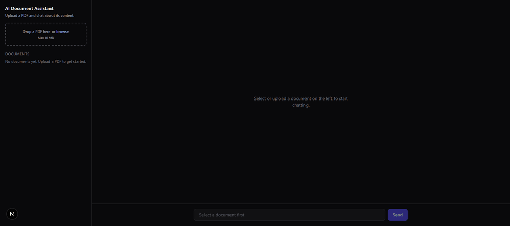
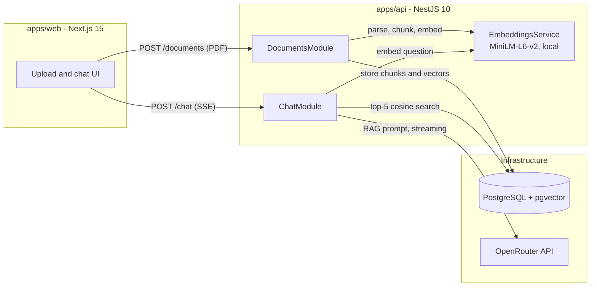

# AI Document Assistant

A retrieval-augmented generation (RAG) application. Upload a PDF, let the API index it with locally generated embeddings, and chat with an AI about its content. Answers stream in real time and cite the document pages they were grounded on.



## What this project demonstrates

- A complete RAG pipeline: PDF parsing, chunking with overlap, embedding, vector retrieval, prompt construction, and grounded generation.
- Local embeddings with `@xenova/transformers` (`Xenova/all-MiniLM-L6-v2`, 384 dimensions). No embedding API, no per-token cost, and documents never leave the machine during indexing.
- Vector similarity search in PostgreSQL with the `pgvector` extension and the cosine distance operator (`<=>`).
- Streaming responses end to end: OpenRouter chat completions are consumed as a stream and re-emitted to the browser over Server-Sent Events.
- Source citations: every answer exposes the exact chunks and page numbers used as context.
- A typed monorepo with npm workspaces: a NestJS API and a Next.js App Router frontend.

## Architecture



## Tech stack

| Layer | Technology |
| --- | --- |
| Frontend | Next.js 15 (App Router), React 19, Tailwind CSS, react-markdown |
| API | NestJS 10, TypeScript, multer, pdf-parse |
| Embeddings | @xenova/transformers (ONNX, runs locally) |
| Vector store | PostgreSQL 16 + pgvector |
| Generation | OpenRouter chat completions (configurable model, streamed) |
| Tests | Jest + ts-jest |

## Setup

Prerequisites: Node.js 20+, Docker, an OpenRouter API key ([openrouter.ai/keys](https://openrouter.ai/keys)).

```bash
# 1. Start PostgreSQL with pgvector
docker compose up -d

# 2. Install all workspace dependencies
npm install

# 3. Configure the environment
cp .env.example .env
# then edit .env and set OPENROUTER_API_KEY

# 4. Run the API (terminal 1)
npm run dev:api

# 5. Run the web app (terminal 2)
npm run dev:web
```

Open http://localhost:3000. The API listens on http://localhost:3001. The database schema (extension and tables) is applied automatically when the API starts.

Note: the first document upload downloads the embedding model (about 25 MB) and caches it locally, so the first indexing takes longer than subsequent ones.

## How it works

### Indexing (upload)

1. `POST /documents` receives a PDF through a multipart form (multer, 10 MB limit, PDF-only validation including the file signature).
2. `pdf-parse` extracts plain text page by page, so every chunk keeps an accurate page number.
3. The text of each page is split into overlapping chunks of roughly 500 tokens (400 words with a 60-word overlap). Chunks never cross page boundaries, which keeps citations precise.
4. Each chunk is embedded locally with MiniLM-L6-v2 into a 384-dimensional normalized vector.
5. The document row and all chunk rows (content, page, embedding) are inserted into PostgreSQL in a single transaction.

### Answering (chat)

1. `POST /chat` receives `{ documentId, message, history }`.
2. The question is embedded locally with the same model used for indexing.
3. pgvector retrieves the 5 most similar chunks of that document using cosine distance (`embedding <=> query ORDER BY ... LIMIT 5`).
4. A RAG prompt is built: a system message containing the numbered excerpts with their page labels, rules to answer only from that context and cite pages, the recent conversation history, and the user question.
5. The prompt is sent to OpenRouter with `stream: true`. The API relays the tokens to the browser as Server-Sent Events: first a `sources` event with the retrieved chunks, then `token` events, then `done`.
6. The frontend renders the streamed markdown incrementally and shows a collapsible "Sources" section with the cited excerpts and pages under the answer.

## API reference

| Method | Path | Description |
| --- | --- | --- |
| POST | /documents | Upload a PDF (multipart field `file`). Returns the indexed document. |
| GET | /documents | List uploaded documents with page and chunk counts. |
| DELETE | /documents/:id | Delete a document and its chunks (cascade). |
| POST | /chat | Body `{ documentId, message, history }`. Responds with an SSE stream. |

## Environment variables

All variables are documented in [.env.example](.env.example).

| Variable | Purpose |
| --- | --- |
| DATABASE_URL | PostgreSQL connection string |
| OPENROUTER_API_KEY | OpenRouter key; required for chat, not for indexing |
| OPENROUTER_MODEL | Chat model (default `openai/gpt-oss-120b:free`) |
| PORT | API port (default 3001) |
| CORS_ORIGIN | Allowed frontend origin |
| NEXT_PUBLIC_API_URL | API base URL used by the frontend |

## Tests

```bash
npm test
```

Unit tests cover the two pure cores of the RAG pipeline: the chunking algorithm (overlap, page boundaries, word preservation, whitespace normalization) and the RAG prompt builder (context injection, citation instructions, history trimming, role filtering).

## Troubleshooting

- **A valid PDF is rejected with `The PDF could not be parsed`.** Old `pdf-parse` 1.x bundles a 2018 build of pdf.js that fails on PDFs produced by modern generators (`bad XRef entry`). This project uses `pdf-parse` v2, which ships a current pdf.js and native per-page text extraction.
- **First upload is slow or appears stuck.** The embedding model is downloaded on first use (about 25 MB) and cached. Subsequent uploads are fast.
- **`@xenova/transformers` import errors in a CommonJS build.** The package is ESM-only. The API loads it through a true dynamic import (see `EmbeddingsService`) instead of a transpiled `require`.
- **Chat returns 503.** `OPENROUTER_API_KEY` is missing. Set it in `.env` and restart the API.
- **`vector` type does not exist.** The database is not running the pgvector image. Use the provided `docker-compose.yml` (`pgvector/pgvector:pg16`).
